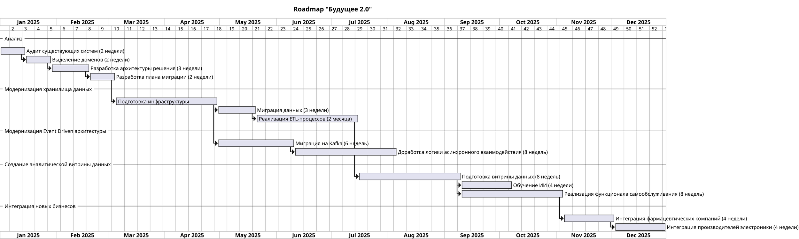

## Roadmap технологической трасформации компании "Будущее 2.0"

### Цели бизнеса

- **Промежуточное состояние (через пару месяцев)**.  
  Сформировано архитектурное решение по трансформации.  
  Уточнены границы доменов и связи между ними.  
  Запланированы конкретные проекты в доменах по развитию «витрины данных»

- **Финальное состояние (через год)**.  
  Реализован портал самообслуживания.  
  Бизнес-пользователи в доменах могут использовать данные в рамках новой архитектуры.  
  На этом этапе можно на некоторое время сохранить легаси-системы в отдельных доменах

### Roadmap

### Результаты этапов

**1. Анализ текущего состояния и подготовка**

**Результаты:**

- Полный аудит существующих систем.
- Определение узких мест, которые нужно устранить в первую очередь.
- Разработка детального плана миграции данных и интеграции новых систем.

**Ответственные команды:**

- Бизнес-аналитики.
- Архитекторы данных.
- Команда DWH.

Этап анализа необходим для получения прозрачного плана трансформации, чтобы все заинтересованные стороны ясно понимали
необходимость трансформации и каким образом она будет достигнута.

**2. Модернизация хранилища данных (DWH)**
**Результаты:**

- Переход с устаревшего Microsoft SQL Server 2008 на современное Data Lakehouse решение.
- Работающие ETL пайплайны
- Интеграция медицинских данных в изолированный слой с учётом требований к конфиденциальности.
- Миграция бизнес-логики из DWH в доменные микросервисы.

**Ответственные команды:**

- Команда DWH.
- Data Engineers.
- Команда безопасности данных.

Модернизация текущего решения хранения и обработки данных необходима, так как существующее решение использует устаревший
инструментарий и паттерны при работе с данными. Это не позволяет компании иметь необходимую гибкость при дальнейшем
росте и
развитии бизнеса.

**3. Модернизация Event-Driven архитектуры**
**Результаты:**

- Замена устаревшей шины данных на Apache Kafka.
- Реализация асинхронного обмена данными между доменами.
- Внедрение сервисов интеграции для внешних подсистем

**Ответственные команды:**

- Backend-разработчики.
- Команда интеграций.
- DevOps команда.

Текущее решение хоть и использует асинхронных обмен данными через шину, но используемые решения являются устаревшими
и не позволяют гибко масштабироваться и выдерживать планируемый многократно увеличенный объем данных. Поэтому необходим
этам переработки механизмов взаимодействия и используемых решений

**4. Создание аналитической витрины данных**
**Результаты:**

- Построение витрины данных на базе нового Data Lakehouse.
- Внедрение современного BI-инструмента.
- Реализация функционала самообслуживания для сотрудников.

**Ответственные команды:**

- BI-аналитики.
- Data Engineers.
- Команда UX/UI.

После модернизации хранилища данных необходим этам адаптации как имеющихся решений, так и новоразработанных для работы с
новой концепцией данных.

**5. Интеграция новых бизнесов**
**Результаты:**

- Лёгкая интеграция фармацевтических компаний и производителей электроники в общую экосистему.
- Расширение архитектуры с минимальными изменениями в существующих системах.

**Ответственные команды:**

- Команда интеграций.
- Архитекторы решений.
- Менеджеры проектов.

На данном этапе предусматривается доработки системы для упрощения и унификации интеграции как имеющихся активов
компании, так и новых в новую систему. Реализация интеграционных слоев, проработка схем и протоколов взаимодействия.